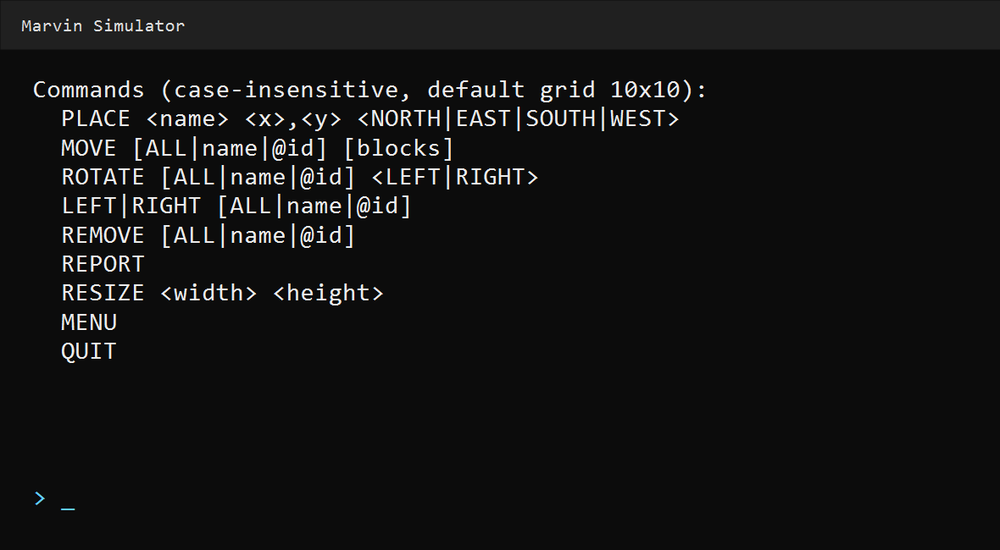

# Marvin (The Paranoid Android)

[](https://github.com/chromagnonman/Marvin/actions/workflows/linux.yml)
[](https://github.com/chromagnonman/Marvin/actions/workflows/windows.yml)
[](https://github.com/chromagnonman/Marvin/actions/workflows/macos.yml)
[](https://github.com/chromagnonman/Marvin/actions/workflows/ci.yml)
[](CMakeLists.txt)

Marvin is a C++20 console application for creating and controlling robots in a two-dimensional
grid. It supports typed command parsing, collision detection, signed coordinates, unique robot
identity, movement and rotation, reporting, and dynamic grid expansion.



## Features

- Place uniquely named robots facing north, east, south, or west.
- Target robots case-insensitively by name or explicitly by ID with `@<id>`.
- Move one robot by a chosen number of blocks or move every robot.
- Rotate one or all robots left or right by 90 degrees.
- Prevent robots from leaving the grid or moving into occupied cells.
- Expand rectangular or square grids while preserving robot positions.
- Reject malformed commands without terminating the simulator.

The default grid is `10x10`. Commands are case-insensitive.

## Requirements

- Windows with Visual Studio or Visual Studio Build Tools.
- Desktop development with C++, CMake, Ninja, and a Windows SDK.
- C++ Clang tools for Windows for clang-format and clang-tidy.
- CMake 3.24 or newer.
- Internet access during the first configure to fetch the pinned GoogleTest dependency.

GoogleTest 1.17.0 is checksum-pinned through CMake FetchContent. No system-wide test framework or
NuGet restore is required.

## Getting Started

```powershell
git clone https://github.com/chromagnonman/Marvin.git
cd Marvin
```

In Visual Studio, select **File > Open > Folder** and open the repository. Visual Studio recognizes
`CMakePresets.json`; select the `debug`, `release`, or `asan` preset and build normally.

From a Developer PowerShell with Ninja on `PATH`:

```powershell
cmake --preset debug
cmake --build --preset debug
.\out\build\debug\Marvin.exe
```

## Commands

```text
PLACE R2D2 1,1 NORTH
MOVE R2D2 2
MOVE @43 2
MOVE ALL
ROTATE R2D2 LEFT
RIGHT @43
REMOVE R2D2
REMOVE ALL
REPORT
RESIZE 20 15
MENU
QUIT
```

Robot names must be unique, are stored canonically, and cannot begin with `@`. Grid coordinates
are signed internally, while placement accepts only non-negative coordinates. Grids can expand
but cannot shrink.

## Architecture

- `marvin_core` is a reusable static library containing the model, parser, grid, menu, and
  simulator logic.
- `Marvin` is a thin console executable linked to `marvin_core`.
- `RobotSimulatorTest` links to `marvin_core` through CMake rather than raw object files.
- `CommandParser` converts input into a typed `std::variant` command before execution.
- `RobotSimulator` maintains case-insensitive unique-name and ID indexes.

## Tests

The GoogleTest suite covers parsing, malformed input, signed movement, rotation, identity,
case-insensitive uniqueness, ID targeting, collisions, boundaries, rectangular grids, resizing,
and command-loop integration.

```powershell
ctest --preset debug
ctest --preset release
ctest --preset asan
```

Use `--output-on-failure` when invoking CTest without the presets.

## Code Quality

- `.clang-format` defines the shared C++20 formatting style.
- `.clang-tidy` enables Clang Analyzer, C++ Core Guidelines, CERT, HICPP, concurrency, bug-prone,
  miscellaneous, modernization, performance, portability, and readability checks.
- All compiler and enabled clang-tidy findings are treated as errors for project-owned code.
- The `debug` preset runs clang-tidy while compiling.
- The `asan` preset instruments Marvin and GoogleTest consistently with AddressSanitizer.

Check formatting without modifying files:

```powershell
$files = git ls-files '*.cpp' '*.h'
clang-format --dry-run --Werror $files
```

Formatting is not applied automatically on save. In Visual Studio, use **Format Document**
(`Ctrl+K, Ctrl+D`).

## Continuous Integration

The GitHub Actions workflows run for pull requests and pushes to `master`:

- [Linux](.github/workflows/linux.yml), [Windows](.github/workflows/windows.yml), and
  [macOS](.github/workflows/macos.yml) independently build and test a Release configuration on
  their native runners.
- The stricter [build](.github/workflows/ci.yml) workflow enforces formatting, builds and tests
  Debug with clang-tidy, builds and tests Release, and runs the full suite under MSVC
  AddressSanitizer.

The release badge reflects the project version declared in `CMakeLists.txt`.

## Potential Enhancements

- Add aerial, aquatic, subaquatic, quadrupedal, and wheeled robot models.
- Render the grid and robot positions in the console.
- Add movement and rotation capabilities specific to each robot type.

## License

This project is licensed under the terms in [LICENSE](LICENSE).
