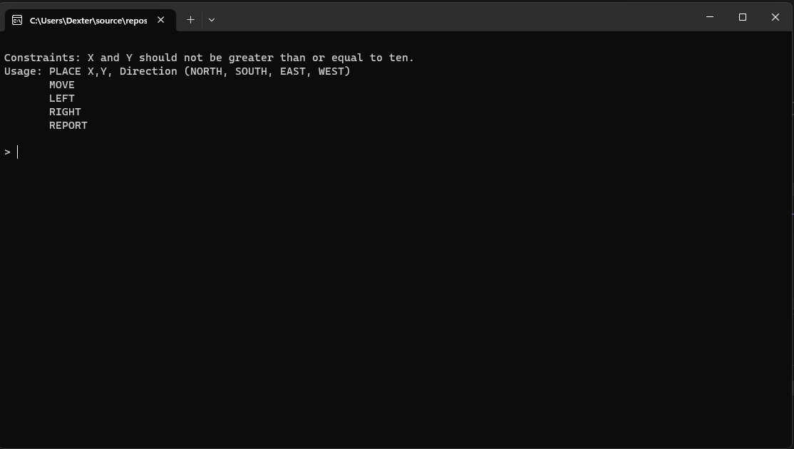

# Marvin (The Paranoid Android)
A simple Toy Robot console application written in C++. User can issue commands to create a robot unto a 2D grid environment, and control its movement.



## Features

- Place a robot unto the cartesian plane using X,Y coordinates with the direction the robot will be facing. (e.g. North, South, West, and East).
- Move robot(s) one unit forward from its relative position in the direction the robot is currently facing.
- Rotate the robot in a 90-degree angle in its specified direction - from left to right, and vice versa.
- Report the robot's info such as id, name, direction, and its position.

## Getting started
Prequisites:
- This is a Windows console application. Your machine should be running on Windows 11 or newer.
- Install the latest Visual Studio IDE available online - the community edition should be sufficient.
- Download the code or simply clone it:
	```
	git@github.com:chromagnonman/Marvin.git
	```
## Running the application
-  Open the entire solution or project by simply double clicking on the `.sln` or `.vcxproj` file. Pressing `CTRL + F5` should run the console application.

## Executing the Unit Tests
- The solution also contains `RobotSimulatorTest` project using Google Test framework. To execute the tests, simply open the Test Explorer and click the play button.

	

## Caveats
- When executing the unit tests you might encounter linker errors. You need to explicitly add the `.obj` files (Marvin, RobotGrid, and RobotSimulator) to the Additional Dependencies
  of the `RobotSimulatorTest` project.

	
- You might also need to update the Additional Libray Directories.
	
- Lastly, you might also need to set the Runtime Library to `Multi-threaded (/MT)`.
	
	

