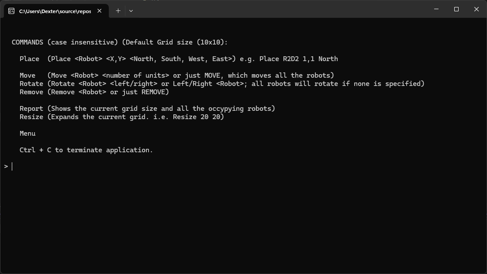
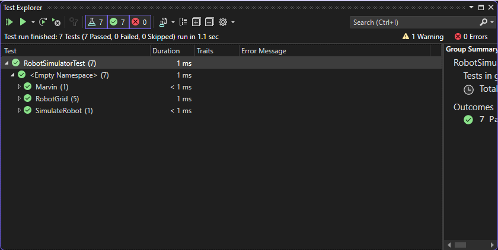

# Marvin (The Paranoid Android)
A simple toy robot console application written in C++. A user can issue commands to create a robot onto a two-dimensional grid environment and control its movement.



## Features

- Place a robot onto the cartesian plane using X and Y coordinates with the direction the robot will be facing. (e.g., North, South, West, and East).
- Move robot(s) one unit forward from its relative position in the direction the robot is currently facing.
- Rotate the robot at a 90-degree angle in its specified direction - from left to right, and vice versa.
- Report the robot's info such as id, name, direction, and position.

## Getting started
Prerequisites:
- This is a Windows console application. Your machine should be running on Windows 11 or newer.
- Install the latest Visual Studio IDE available online with C++ 17 compiler or newer. The community edition should be sufficient.
- Download the code or clone it:
	```
	git@github.com:chromagnonman/Marvin.git
	```
## Running the application
-  Open the entire solution or project by double-clicking on the `.sln` or `.vcxproj` file. Pressing `CTRL + F5` should run the console application.

## Executing the unit tests
- The solution also contains a `RobotSimulatorTest` project utilizing the Google Test framework. To execute the tests, open the `Test Explorer` and click the play button.

	

## Caveat
- When executing the unit tests, you may encounter linker errors. You need to explicitly add the `.obj` files (Marvin, RobotGrid, and RobotSimulator) to the `Additional Dependencies`
  of the `RobotSimulatorTest` project.

	
- You might also need to update the `Additional Library Directories`.

	
- Lastly, you will probably need to set the `Runtime Library` to `Multi-threaded (/MT)`.

	
	

